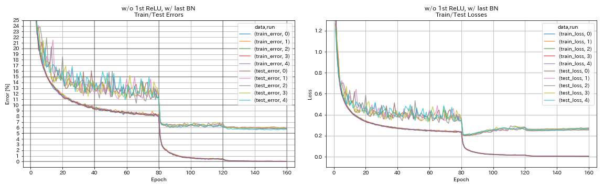
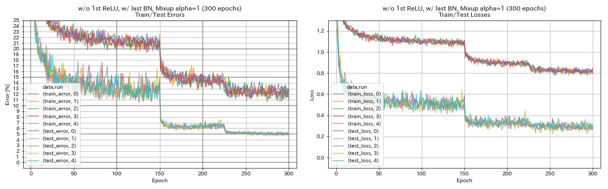

# PyTorch Implementation of Mixup


## Usage

```
$ python main.py --block_type basic --depth 110 --use_mixup --mixup_alpha 1 --outdir results
```


## Results on CIFAR-10

| Model                                               | Test Error (1 run)      |
|:----------------------------------------------------|:-----------------------:|
| ResNet-preact-56 w/ Mixup alpha = 0.5 (160 epochs)  | 5.55                    |
| ResNet-preact-56 w/ Mixup alpha = 1 (160 epochs)    | 5.62 (median of 3 runs) |
| ResNet-preact-56 w/ Mixup alpha = 2 (160 epochs)    | 6.14                    |
| ResNet-preact-56 w/ Mixup alpha = 1 (300 epochs)    | 5.11 (median of 5 runs) |
| ResNet-preact-110 w/ Mixup alpha = 1 (300 epochs)   | 4.26                    |

| Model                                   | Test Error (median of 5 runs) | Training Time |
|:----------------------------------------|:-----------------------------:|--------------:|
| ResNet-preact-56 w/o Mixup (160 epochs) | 5.85                          |    98 min     |
| ResNet-preact-56 w/ Mixup (300 epochs)  | 5.11                          |   191 min     |

### w/o Mixup
```
$ python -u main.py --depth 56 --block_type basic --base_lr 0.2 --epochs 160 --milestones '[80, 120]' --seed 7 --outdir results/wo_mixup/00
```



### w/ Mixup
```
$ python -u main.py --depth 56 --block_type basic --base_lr 0.2 --use_mixup --mixup_alpha 1 --epochs 300 --milestones '[150, 225]' --seed 7 --outdir results/w_mixup/00
```




## References

* Hongyi Zhang, Moustapha Cisse, Yann N. Dauphin, David Lopez-Paz. "mixup: Beyond Empirical Risk Minimization." arXiv preprint arXiv:1710.09412. [arXiv:1710.09412]( https://arxiv.org/abs/1710.09412 )


